# Лабораторна робота №3 — Архітектурне, ER- та UX/UI-проєктування

### Архітектурний стиль та діаграма
Обрано трирівневу клієнт-серверну архітектуру (презентаційний рівень, рівень логіки, рівень даних).
Такий стиль забезпечує розділення відповідальностей, спрощує тестування та масштабування.
На рисунку зображено компоненти системи та зв'язки між ними.

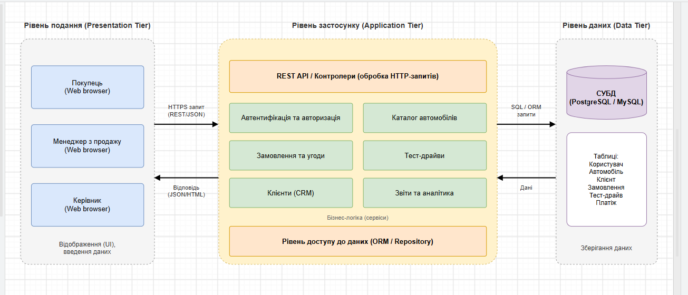

### ER-діаграма
ER-діаграма відображає логічну модель даних проєкту: основні сутності, їхні атрибути та зв'язки.
Використано нотацію Crow's Foot. Діаграма слугує основою для фізичної схеми бази даних.

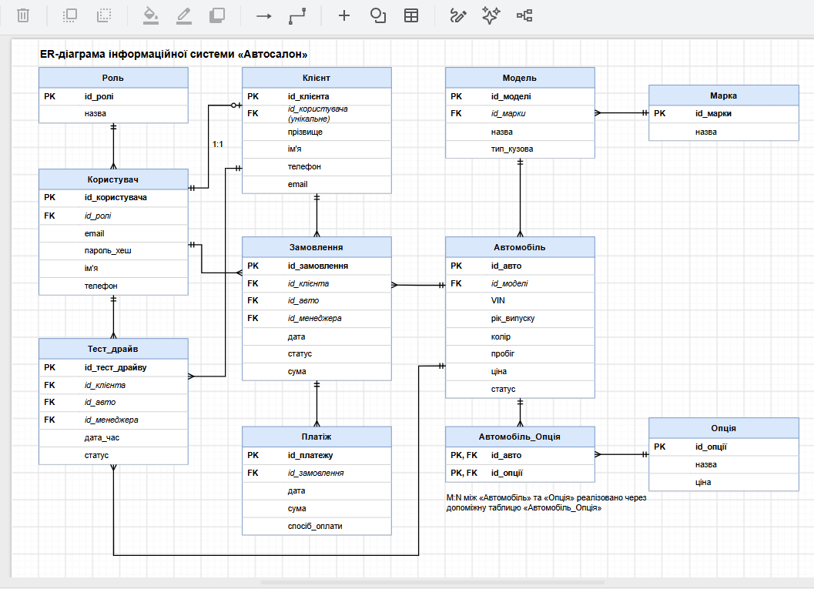

### UX/UI: каркаси (wireframes)
Каркаси визначають розташування основних блоків інтерфейсу без деталізації стилів.
Розроблено каркаси для всіх ключових екранів системи.

**Вхід**
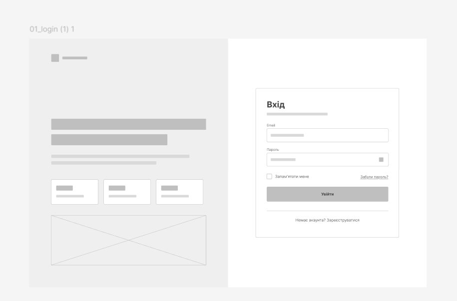

**Каталог**
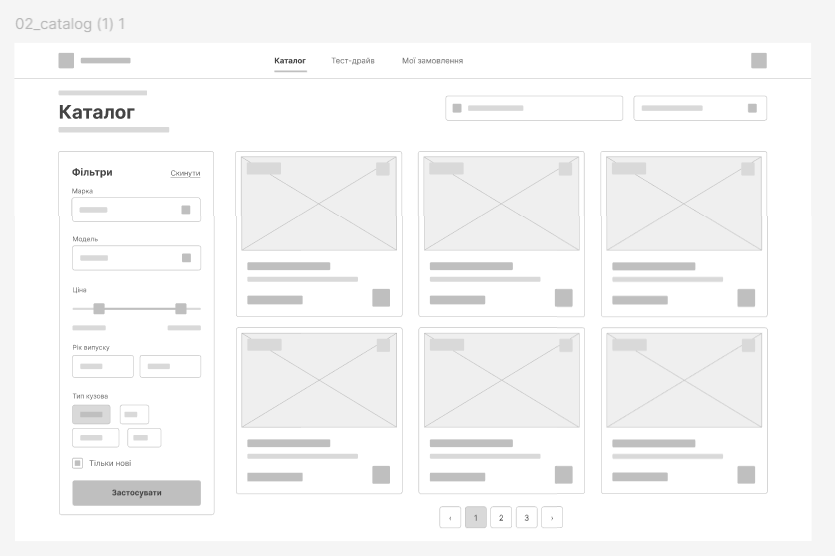

**Деталі авто**
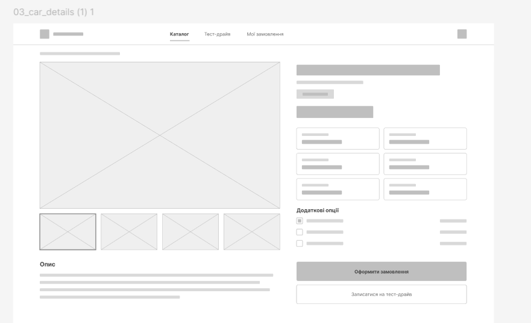

**Тест-драйв**
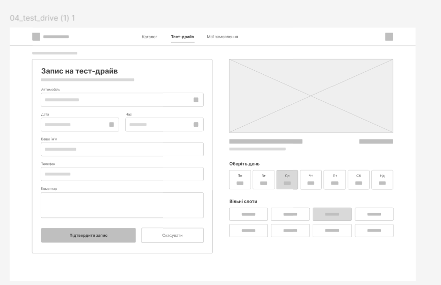

**Оформлення замовлення**
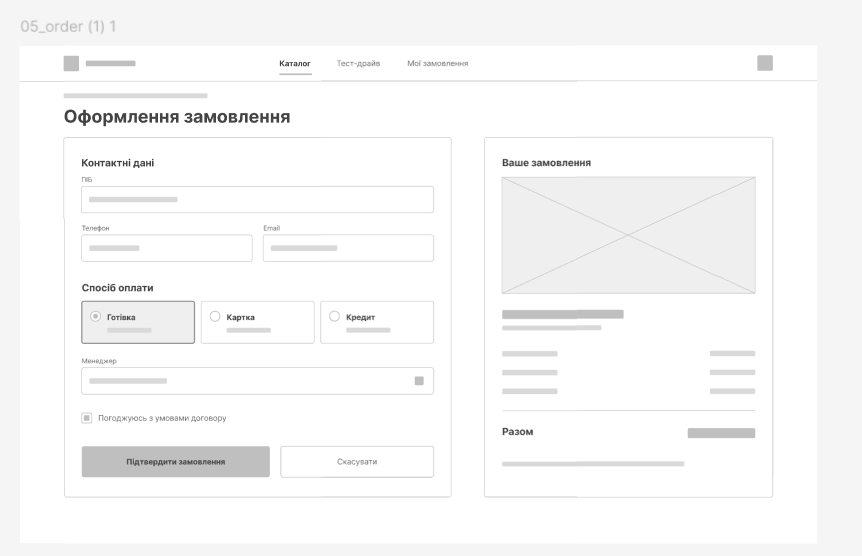

**Панель менеджера**
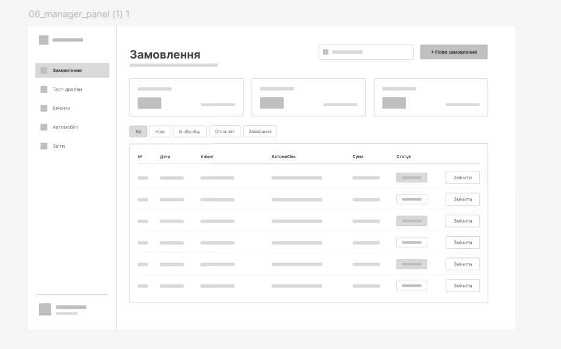

### UX/UI: макети (mockups)
Макети демонструють фінальний вигляд інтерфейсу з кольорами, типографікою та станами елементів.
Макети розроблено на основі відповідних каркасів, у єдиному візуальному стилі.

**Вхід**
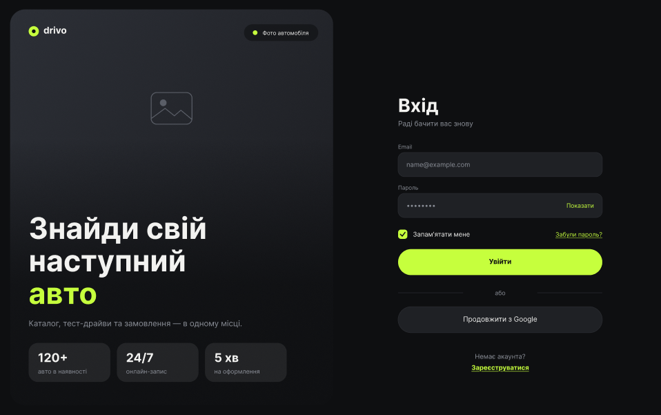

**Каталог**
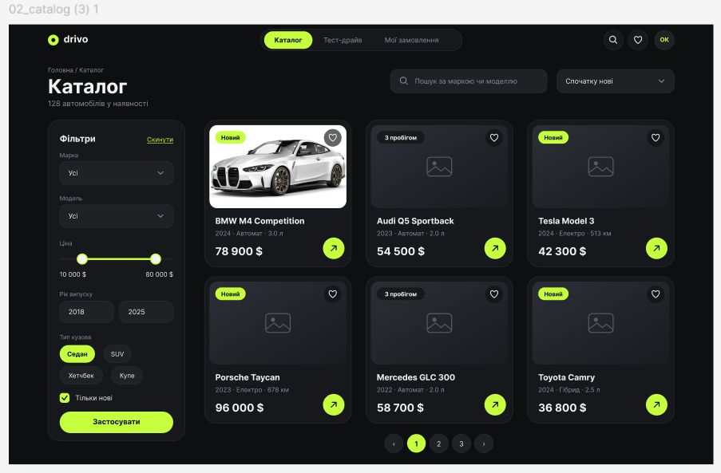

**Деталі авто**
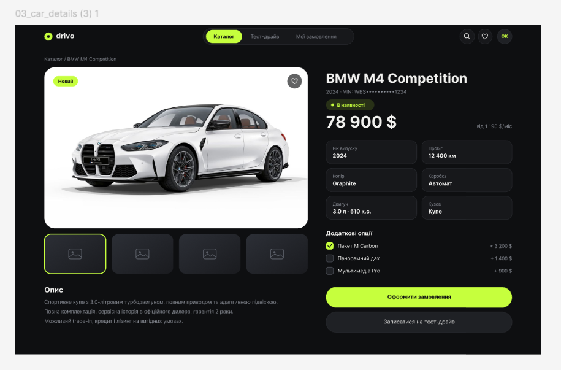

**Тест-драйв**
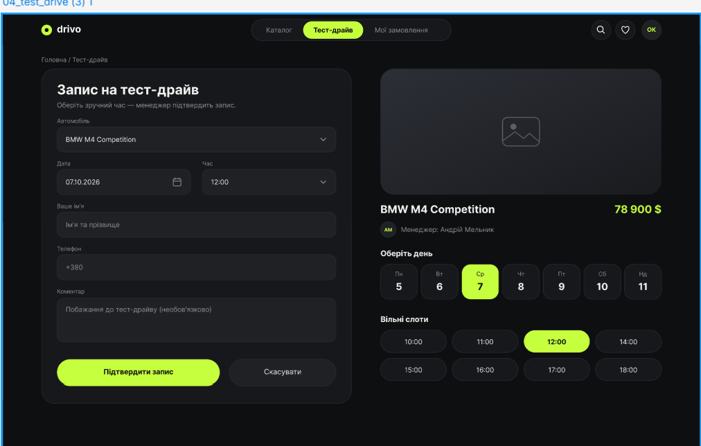

**Оформлення замовлення**
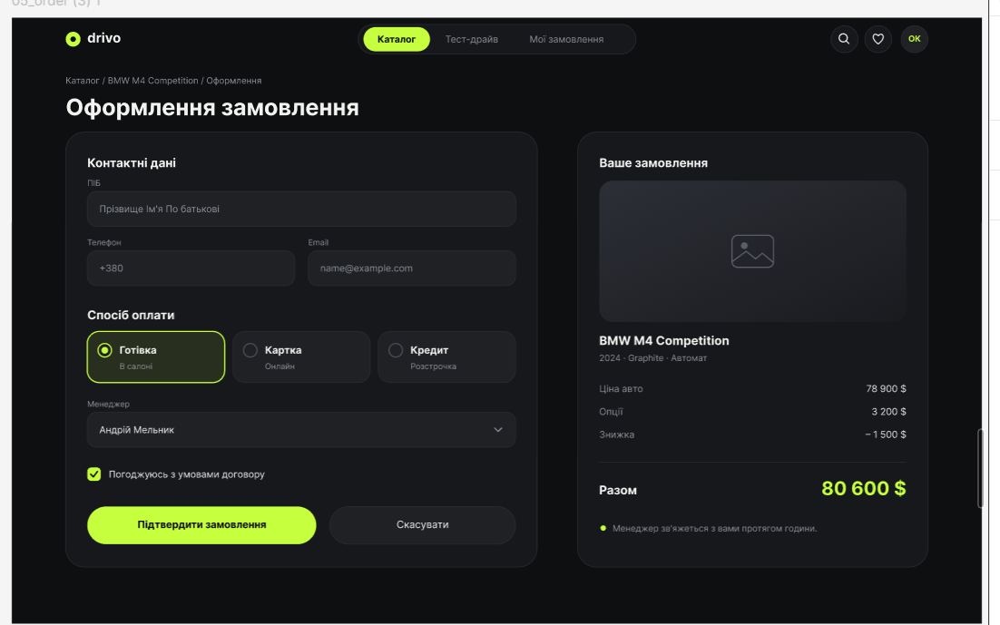

**Панель менеджера**
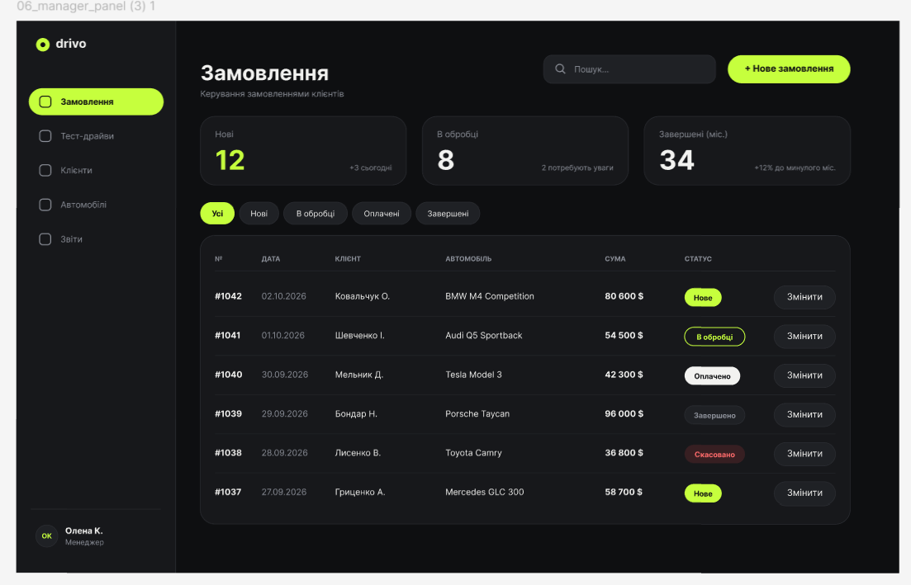

### Структура каталогу
- `architecture-diagram.png` — архітектурна діаграма системи;
- `er-diagram.png` — ER-діаграма моделі даних;
- `wireframe/` — каркаси екранів (6 шт.);
- `mockup/` — фінальні макети екранів (6 шт.).
ьні макети екранів (6 шт.).